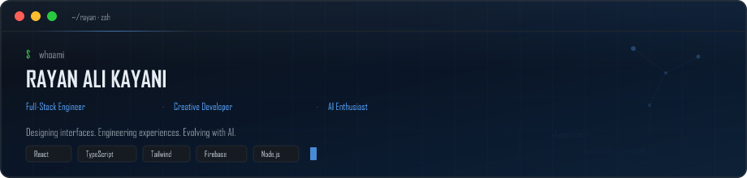

<!-- ═══════════════════════════════════════════════════════════════════════════
     RAYAN ALI KAYANI — GitHub Profile README
     github.com/Rayan-Ali-Kayani/Rayan-Ali-Kayani
     ═══════════════════════════════════════════════════════════════════════════ -->

<div align="center">

<!-- HERO BANNER -->


<!-- TYPING IDENTITY -->


<br/><br/>

<!-- TERMINAL HERO -->


<br/>

<!-- CTA BADGES -->
<a href="https://github.com/Rayan-Ali-Kayani" target="_blank" rel="noopener noreferrer">
  
</a>
<a href="https://linkedin.com/in/YOUR-LINKEDIN-USERNAME" target="_blank" rel="noopener noreferrer">
  
</a>
<a href="https://YOUR-PORTFOLIO-URL.com" target="_blank" rel="noopener noreferrer">
  
</a>
<a href="mailto:YOUR-EMAIL@example.com">
  
</a>

</div>

<br/>

<!-- POSITIONING -->
<div align="center">

### I engineer digital experiences where **performance**, **usability**, **motion**, and **visual design** converge — not as separate concerns, but as one coherent product.

<sub>Full-Stack Engineer · Creative Developer · AI Enthusiast · SEO-aware builder</sub>

</div>

<br/>

---

<br/>

<!-- ABOUT -->
## ◈ About

<table>
<tr>
<td width="65%" valign="top">

I build **fast, responsive, accessible, and visually refined** web applications — from interactive frontends to full-stack systems backed by cloud services.

My work sits at the intersection of **frontend engineering**, **UI/UX craft**, and **AI-powered innovation**. I care about how interfaces *feel* as much as how they *function*: motion with intent, typography with hierarchy, architecture with room to scale.

I'm not interested in shipping pages. I'm interested in shipping **experiences** — products where every interaction, animation, and layout decision serves the user.

</td>
<td width="35%" valign="top">

<br/>

| | |
|:---|:---|
| **Location** | Peshawar, Pakistan |
| **Education** | BS Computer Science |
| **Role** | Full-Stack Developer |
| **Focus** | Frontend · AI · Cloud |

<br/>

**Interests**

`Frontend Engineering` `Creative Dev` `UI/UX` `AI Integration` `Cloud`

</td>
</tr>
</table>

<br/>

---

<br/>

<!-- CURRENTLY BUILDING -->
## ◈ Currently Building

<table>
<tr>
<td align="center" width="25%">
<br/>
<b>⚡ Modern React Apps</b><br/><br/>
<small>Component-driven UIs with TypeScript & Tailwind</small><br/><br/>
</td>
<td align="center" width="25%">
<br/>
<b>🔗 Full-Stack Systems</b><br/><br/>
<small>Firebase · Node.js · Cloud deployments</small><br/><br/>
</td>
<td align="center" width="25%">
<br/>
<b>🤖 AI-Powered UX</b><br/><br/>
<small>LLM integrations & intelligent workflows</small><br/><br/>
</td>
<td align="center" width="25%">
<br/>
<b>✦ Interactive Experiences</b><br/><br/>
<small>GSAP · Motion · Creative interfaces</small><br/><br/>
</td>
</tr>
</table>

<br/>

---

<br/>

<!-- TECH STACK -->
## ◈ Technology Ecosystem

<div align="center">

<sub>Curated stack — not a badge wall. Each tool chosen for a reason.</sub>

<br/><br/>

**Frontend**


<br/><br/>

**Animation & Creative**


&nbsp;

&nbsp;

&nbsp;


<br/><br/>

**Backend & Cloud**


<br/><br/>

**Tooling**


<br/><br/>

**AI & Emerging**


&nbsp;

&nbsp;


</div>

<br/>

---

<br/>

<!-- ENGINEERING PRINCIPLES -->
## ◈ Engineering Principles

<table>
<tr>
<td width="50%" valign="top">

### 01 — Design with Intent

Every pixel, transition, and layout choice must answer a user need — not fill empty space.

### 02 — Performance is Non-Negotiable

A beautiful interface that loads slowly is a broken interface. Speed is part of the experience.

### 03 — Accessibility by Default

Inclusive design isn't a feature flag. Products should work for everyone, on every device.

</td>
<td width="50%" valign="top">

### 04 — Simplicity at the Surface

Complex systems should feel effortless. Hide the architecture; reveal the clarity.

### 05 — Build for Tomorrow

Write code and structure systems that can evolve — without rewriting everything to grow.

### 06 — Ship, Learn, Refine

Every project is a prototype for the next one. Iterate in public. Improve continuously.

</td>
</tr>
</table>

<br/>

---

<br/>

<!-- FEATURED PROJECTS -->
## ◈ Featured Work

<sub>Selected projects — each one a deliberate engineering decision.</sub>

<br/>

<table>
<tr>
<td width="50%" valign="top">

### Global Degree College Peshawar
<sub>Modern institutional web presence</sub>

**What it is** — A responsive college website with structured information architecture and polished UI.

**Problem solved** — Outdated, non-responsive institutional sites that fail on mobile and lack visual credibility.

**Stack** — `React` `TypeScript` `Tailwind CSS` `Vite` `Framer Motion`

**Engineering decision** — Component-driven architecture with motion applied selectively to guide attention, not distract.

**Key feature** — Fluid responsive layouts with animated section transitions.

<br/>

[→ Live Demo](https://YOUR-GDC-DEMO-URL.com) · [→ Source](https://github.com/Rayan-Ali-Kayani/YOUR-GDC-REPO)

</td>
<td width="50%" valign="top">

### Aurevia
<sub>Full-stack restaurant experience</sub>

**What it is** — End-to-end restaurant application with auth, data persistence, and media management.

**Problem solved** — Fragmented restaurant tools with no unified digital ordering and management flow.

**Stack** — `React` `Vite` `Firebase Auth` `Firestore` `Cloudinary` `Vercel`

**Engineering decision** — Firebase for real-time data with Cloudinary for optimized media delivery.

**Key feature** — Secure authentication with cloud-hosted, production-ready deployment.

<br/>

[→ Live Demo](https://YOUR-AUREVIA-URL.com) · [→ Source](https://github.com/Rayan-Ali-Kayani/YOUR-AUREVIA-REPO)

</td>
</tr>
<tr>
<td width="50%" valign="top">

<br/>

### CyberShield
<sub>Cybersecurity awareness simulator</sub>

**What it is** — Interactive simulator that teaches security concepts through hands-on scenarios.

**Problem solved** — Abstract cybersecurity education that fails to engage or simulate real threats.

**Stack** — `React` `Modern UI` `Interactive UX`

**Engineering decision** — Scenario-based interaction design over static content delivery.

**Key feature** — Immersive, educational user flows that make security tangible.

<br/>

[→ Live Demo](https://YOUR-CYBERSHIELD-URL.com) · [→ Source](https://github.com/Rayan-Ali-Kayani/YOUR-CYBERSHIELD-REPO)

</td>
<td width="50%" valign="top">

<br/>

### IRONPULSE GYM
<sub>Interactive fitness brand site</sub>

**What it is** — A high-energy gym website with motion-driven storytelling and modern aesthetics.

**Problem solved** — Generic fitness websites with no personality or interactive engagement.

**Stack** — `React` `GSAP` `Modern CSS`

**Engineering decision** — GSAP timeline animations orchestrated for performance, not decoration.

**Key feature** — Scroll-driven animations that reinforce brand energy.

<br/>

[→ Live Demo](https://YOUR-IRONPULSE-URL.com) · [→ Source](https://github.com/Rayan-Ali-Kayani/YOUR-IRONPULSE-REPO)

</td>
</tr>
<tr>
<td width="50%" valign="top">

<br/>

### WANDERLUST
<sub>Travel agency platform</sub>

**What it is** — A travel-focused website emphasizing visual storytelling and responsive design.

**Problem solved** — Travel sites that prioritize imagery but sacrifice usability and mobile performance.

**Stack** — `React` `Responsive UI` `Modern CSS`

**Engineering decision** — Image-first layout with strict performance budgets on mobile.

**Key feature** — Destination showcases with clean, conversion-oriented navigation.

<br/>

[→ Live Demo](https://YOUR-WANDERLUST-URL.com) · [→ Source](https://github.com/Rayan-Ali-Kayani/YOUR-WANDERLUST-REPO)

</td>
<td width="50%" valign="top">

<br/>

### SCRAMBLEX · QRcraft · Aurum

<table>
<tr>
<td>

**SCRAMBLEX**
Interactive word-scramble game
`React` · `Game Logic`

[→ Source](https://github.com/Rayan-Ali-Kayani/YOUR-SCRAMBLEX-REPO)

</td>
</tr>
<tr>
<td>

**QRcraft**
QR code generation utility
`React` · `Utility`

[→ Source](https://github.com/Rayan-Ali-Kayani/YOUR-QRCRAFT-REPO)

</td>
</tr>
<tr>
<td>

**Aurum**
Expense tracker with analytics
`React` · `Data Viz`

[→ Source](https://github.com/Rayan-Ali-Kayani/YOUR-AURUM-REPO)

</td>
</tr>
</table>

</td>
</tr>
</table>

<br/>

---

<br/>

<!-- HOW I BUILD -->
## ◈ How I Build

<div align="center">

```
    IDEA
      │
      ▼
  RESEARCH ──────► Understand the problem before touching the editor
      │
      ▼
 ARCHITECTURE ───► Structure systems that can grow without breaking
      │
      ▼
   DESIGN ───────► Wire intent into layout, type, and interaction
      │
      ▼
   BUILD ────────► Write clean, typed, component-driven code
      │
      ▼
   TEST ─────────► Validate behavior, responsiveness, and edge cases
      │
      ▼
  OPTIMIZE ─────► Measure, refine, and eliminate waste
      │
      ▼
  DEPLOY ───────► Ship to production with confidence
```

<sub>I value the entire product-development lifecycle — not just the commit.</sub>

</div>

<br/>

---

<br/>

<!-- TERMINAL SECTION -->
## ◈ Terminal

<details open>
<summary><b>$ cat ~/.rayan/profile.json</b></summary>

<br/>

```bash
$ whoami
Rayan Ali Kayani

$ role
Full-Stack Developer

$ focus
├── Full-Stack Engineering
├── Creative Development
├── AI Integration
└── Frontend Architecture

$ philosophy
"Build experiences. Solve problems. Keep learning."

$ status
Currently accepting interesting projects and collaborations.

$ connect --all
→ github.com/Rayan-Ali-Kayani
→ linkedin.com/in/YOUR-LINKEDIN-USERNAME
→ YOUR-PORTFOLIO-URL.com
→ YOUR-EMAIL@example.com
```

</details>

<br/>

---

<br/>

<!-- GITHUB ACTIVITY -->
## ◈ Building in Public

<div align="center">

<sub>Every contribution is another experiment, another problem solved, or another idea turned into code.</sub>

<br/><br/>


&nbsp;


<br/><br/>


&nbsp;


</div>

<br/>

---

<br/>

<!-- CURRENTLY EXPLORING -->
## ◈ Currently Exploring

<table>
<tr>
<td align="center" width="33%">
<b>Advanced React Architecture</b><br/>
<small>Patterns, composition & scalable state</small>
</td>
<td align="center" width="33%">
<b>TypeScript Depth</b><br/>
<small>Type-safe systems at scale</small>
</td>
<td align="center" width="33%">
<b>AI Integration</b><br/>
<small>LLMs & agentic workflows in products</small>
</td>
</tr>
<tr>
<td align="center" width="33%">
<b>Cloud Infrastructure</b><br/>
<small>Firebase · GCP · Cloud Run</small>
</td>
<td align="center" width="33%">
<b>Performance Engineering</b><br/>
<small>Core Web Vitals & optimization</small>
</td>
<td align="center" width="33%">
<b>Advanced UI/UX</b><br/>
<small>Motion design & interaction patterns</small>
</td>
</tr>
</table>

<sub>Areas of active growth — always learning, never claiming mastery prematurely.</sub>

<br/>

---

<br/>

<!-- BEYOND CODE -->
## ◈ Beyond Code

<table>
<tr>
<td width="50%" valign="top">

When I'm not in the editor, you'll find me in **developer communities**, **hackathons**, and **AI experimentation** sessions — exploring what's next in web technology.

I believe the best engineers are perpetual learners. Side projects, open-source exploration, and collaborative building keep my skills sharp and my perspective fresh.

</td>
<td width="50%" valign="top">

**Outside the codebase**

- Technology communities & meetups
- Hackathons & build sprints
- AI tooling experimentation
- Open-source exploration
- Learning in public

</td>
</tr>
</table>

<br/>

---

<br/>

<!-- CONNECT -->
<div align="center">

## ◈ Connect

### Have an idea worth building?

### **Let's turn it into something people remember.**

<br/>

<a href="https://github.com/Rayan-Ali-Kayani" target="_blank" rel="noopener noreferrer">
  
</a>
<a href="https://linkedin.com/in/YOUR-LINKEDIN-USERNAME" target="_blank" rel="noopener noreferrer">
  
</a>
<a href="https://YOUR-PORTFOLIO-URL.com" target="_blank" rel="noopener noreferrer">
  
</a>
<a href="mailto:YOUR-EMAIL@example.com">
  
</a>

<br/><br/>


</div>

<br/>

---

<br/>

<!-- FOOTER -->
<div align="center">


<br/>

**BUILD** &nbsp;·&nbsp; **LEARN** &nbsp;·&nbsp; **CREATE** &nbsp;·&nbsp; **ITERATE**

<br/><br/>

**© Rayan Ali Kayani**

<sub>Crafted with curiosity and code.</sub>

<br/><br/>


</div>
